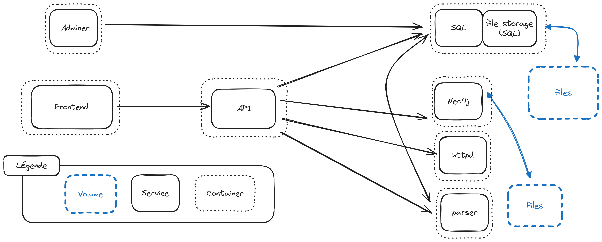

# WAF-GUARD

The **W**eb **A**pplication **F**irewall **G**raph-based **U**nderstanding, **A**nalysis and **R**epresentation for **D**ebugging (**WAF-GUARD**) is an analyzer coupled with an interactive web interface that gives users access to all information encoded in a WAF configuration, as an Apache server with the ModSecurity module would see it. It is written in Python and uses Neo4j and PostgreSQL to store analysis results. Its architecture consists of multiple microservices to facilitate deployment onto a variety of systems. The containerization is done using Docker and services interact with each other through REST APIs.

## Project

This project operate in two steps:
 - The analysis of the config
 - The exploitation and exploration of the extracted information

The first step is performed in the `config manager` page, the second one is enabled by the interfaces of the streamlit, neo4j and adminer docker services.

The project is structured as follows:
```
.
├── docker/                 # Docker configuration files and persistent data
├── src/                    # Source code for the project
│   ├── analyzer/           # Analyzer responsible for the analysis of the dumps
│   │                               and populating the DBs.
│   ├── waf_rest_api/       # WAF implementation (apache + modsecurity) + REST API endpoint
│   │                               responsible of dumping the configs
│   └── web_app/            # Streamlit web application for management, exploration and visualization
├── .env                    # Environment variables configuration
└── README.md               # Project documentation
```

This structure organizes the project into logical components, making it easier to maintain and extend.

### Services Architecture


## Installation

### Environment
Create a `.env` file with the following content:

   ```
   PWD=<path-to-the-root-of-this-project>

   NEO4J_URL=bolt://localhost:7687
   NEO4J_USER=neo4j
   NEO4J_PASSWORD=<your-password>

   POSTGRES_URL=localhost
   POSTGRES_USER=admin
   POSTGRES_PASSWORD=<your-password>

   DOCKER_DATA_PATH=${PWD}/docker/docker_data
   EXPORT_DIR=${DOCKER_DATA_PATH}/db_exports
   SRC_PATH=${PWD}/src
   WEB_APP_PATH=${SRC_PATH}/web_app
   CHATBOT_PATH=${SRC_PATH}/chatbot
   ```

### WAF instance
The WAF docker service is used to create a httpd dump of the your configs. Therefore it must be compatible with your configs.

To do so, the WAF instance necessitate to put all WAF installation files in `docker/docker_data/waf/waf_inst` directory. Ensure that your installation includes a mandatory `install.sh` script, which will handle all necessary setup steps. This script should be executable and will be used by the Docker container to automate the installation and configuration of the WAF components.

### Docker containers

1. Ensure Docker and Docker Compose are installed on your system. (the [docker engine](https://docs.docker.com/engine/install/) and the [compose](https://docs.docker.com/compose/install/) plugin or compose standalone)
1. Build and run the containers:
   ```
   docker compose up -d
   ```
1. You should see 9 services running:
```
[+] Running 9/9
 ✔ Network   default          Created
 ✔ Container neo4j            Healthy
 ✔ Container waf              Started
 ✔ Container postgres         Healthy
 ✔ Container adminer          Started
 ✔ Container analyzer         Started
 ✔ Container fastapi          Started
 ✔ Container streamlit        Started
 ✔ Container chatbot          Started
 ```

## Quick Start

1. Access the interface at `http://localhost:8501/config_manager` under the **_Add New Config_** section, choose a name for your config, drag&drop a zip of your configuration and click on the `Submit` button. This will save all the files of your configuration and generate a dump of your config. It might take up to 1 minute.
Your Zip file can eather contain the `conf` directory at its root, or directly the content of the `conf` directory.

2. A new entry is now available in the **_Known Configs_** section, select it and press the `Analyze & Load Config`. This will trigger the analysis process, and will take a long time. **No feedback mechanism are currently implemented, meaning that the page will freeze saying _"running"_ for ages.** If you want to examin the process, please consult the logs of the `analyzer` service.
   ```console
   docker compose logs analyzer -f
   ```
   Once the process has finished analyzing the configuration dump and populating the Neo4j and PostgreSQL databases with the directives, your entry will now be highlighted in yellow.

3. Access the interface at `http://localhost:8501` to query part of the Neo4j graph, filter directives by an http query or track what impact does a constant have.
   > You can directly query the neo4j database using the interface at `http://localhost:7474` and the postgresql database using the interface at `http://localhost:8080`.
