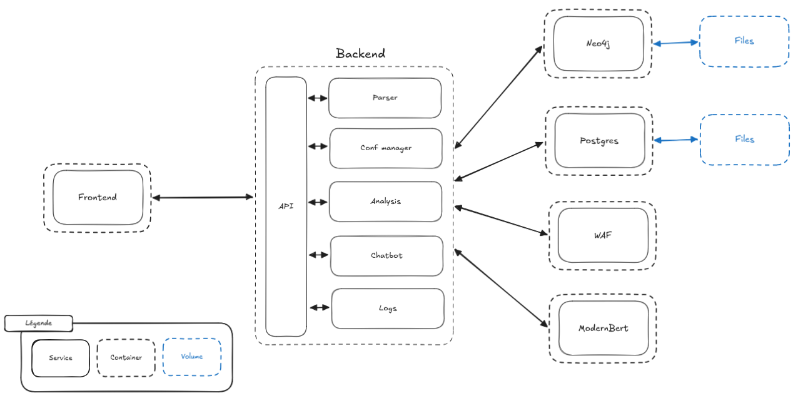

# WAF-GUARD

The **W**eb **A**pplication **F**irewall **G**raph-based **U**nderstanding, **A**nalysis and **R**epresentation for **D**ebugging (**WAF-GUARD**) is an analyzer coupled with an interactive web interface that gives users access to all information encoded in a WAF configuration, as an Apache server with the ModSecurity module would see it. It is written in Python and uses Neo4j and PostgreSQL to store analysis results. Its architecture consists of multiple microservices to facilitate deployment onto a variety of systems. The containerization is done using Docker and services interact with each other through REST APIs.

## Project

The project operates in two steps:
 - The analysis of a configuration
 - The exploitation and exploration of the extracted information

You upload a configuration on the **Configurations** page, which sends it to the WAF container to
produce an `httpd -S`-style dump, then parses that dump into PostgreSQL and Neo4j. Everything
afterwards — directive search, request simulation, impact analysis, the chatbot — reads those two
databases.

```
.
├── backend/                # FastAPI application (single container, one router per domain)
│   └── src/
│       ├── api/routes/     # auth, configurations, parser, analysis, chatbot, logs
│       ├── services/       # business logic: auth, configmanager, waf, parser,
│       │                   #   analysis, chatbot, logs
│       ├── shared/         # settings, PostgreSQL + Neo4j connections, models
│       └── storage/        # uploaded configs and their dumps (gitignored)
├── frontend/waf-react/     # Next.js app-router UI
├── waf/                    # Apache + ModSecurity container
│   ├── src/main.py         #   REST API that dumps a configuration
│   └── scripts/            #   your WAF installer — see below (gitignored)
├── old/                    # pre-migration code, kept for reference
├── DOC.md                  # backend reference: services, routes, migration status
├── PARSER.md               # how the parser works and its known defects
├── .env.example            # template for the .env read by docker compose
└── docker-compose.yaml
```

### Services Architecture


The backend is one container: the API layer fronts the parser, config manager, analysis, chatbot
and log services, which share the PostgreSQL and Neo4j connections. Adminer is not shown — it is
a stand-alone web client for PostgreSQL.

| Service | Container | Port | Role |
|---|---|---|---|
| Frontend | `react_na` | 8002 | Next.js web interface |
| API | `backend_na` | 8000 | FastAPI backend, OpenAPI docs at `/docs` |
| WAF | `waf_na` | 9090 → 8000 | Apache + ModSecurity, produces the config dump |
| Neo4j | `neo4j_na` | 7474, 7687 | directive graph, browser at 7474 |
| PostgreSQL | `postgres_na` | 5432 | users, configurations, directives, symbol table |
| Adminer | `adminer_na` | 8080 | PostgreSQL web client |
| Log classifier | `model_na` | 8102 | ModernBERT model used by the log analysis service |

## Installation

### Environment

Copy the template and fill it in:

```bash
cp .env.example .env
```

It holds the Neo4j and PostgreSQL credentials, `WAF_URL`, the `JWT_SECRET_KEY` used to sign login
tokens, and `OPENAI_API_KEY` for the chatbot. Every variable is described in the file; leaving
`OPENAI_API_KEY` empty disables the chatbot page but nothing else. `.env` is gitignored — keep
your key out of `.env.example`.

### WAF instance

The WAF container produces the httpd dump of your configuration, so its installation must match
the configs you intend to analyze. Put your WAF installation files in `waf/scripts/` (the
directory is gitignored, so it is empty on a fresh clone). It must contain an executable
`install.sh`, which the [Dockerfile](waf/Dockerfile) runs at build time, and a `modules/`
directory whose contents are copied into `/usr/local/lib64/httpd/modules/`.

### Docker containers

1. Ensure Docker and Docker Compose are installed on your system (the [docker engine](https://docs.docker.com/engine/install/) and the [compose](https://docs.docker.com/compose/install/) plugin or compose standalone).
2. Build and run the containers:
   ```
   docker compose up -d
   ```
3. You should see 7 services running:
```
[+] Running 7/7
 ✔ Container neo4j_na       Healthy
 ✔ Container postgres_na    Healthy
 ✔ Container waf_na         Started
 ✔ Container adminer_na     Started
 ✔ Container model_na       Started
 ✔ Container backend_na     Started
 ✔ Container react_na       Started
```

The databases live in the named volumes `neo4j_data`, `neo4j_logs` and `postgres_data`, so they
survive `docker compose down`. `docker compose down -v` deletes them.

## Quick Start

1. Open `http://localhost:8002`, register an account and log in.

2. On the **Configurations** page, create a configuration and upload a zip of your config. The zip
   can either contain the `conf` directory at its root, or the contents of `conf` directly. This
   stores the files and asks the WAF container for a dump — up to a minute.

3. Parse it from the same page. Parsing is a background job: the request returns immediately and
   the page polls for the result, which for a large configuration takes minutes. To watch it:
   ```console
   docker compose logs backend_na -f
   ```
   Once it completes, the configuration is marked parsed and becomes selectable as your active
   configuration. Every analysis route is scoped to that selection.

4. Explore: **Directives** to search and filter directives or simulate an HTTP request,
   **Dashboard** for configuration statistics, **Chatbot** to ask questions about the config in
   natural language, **Logs** to classify WAF log sessions.
   > You can also query Neo4j directly at `http://localhost:7474` and PostgreSQL through Adminer
   > at `http://localhost:8080`.

   > The **Query Graph** (`/cypher`) page is still wired to endpoints that the migration dropped
   > and currently fails on every action — see [DOC.md](DOC.md).

## Documentation

- [DOC.md](DOC.md) — service-by-service backend reference, all 47 routes, and the migration
  status of each service.
- [PARSER.md](PARSER.md) — the dump format, the context chain, constant and variable recovery,
  and the parser's known defects.

## License

WAF-GUARD is released under the [MIT License](LICENSE).

## Acknowledgements

This project is supported by Approach Cyber.
This study has been conducted as part of the COODEVIIS project (agreement no. 8887), funded by the Wallonia Public Service (SPW) under the framework of the region’s recovery plan. It was in part supported by the CyberExcellence project (RW, Convention 2110186).

## Contact

For questions, suggestions, or issues, please open an issue on this repository or contact us directly at [bastien.wiaux@uclouvain.be](mailto:bastien.wiaux@uclouvain.be).

---

Thank you for using WAF-GUARD! We hope it enhances your experience in managing WAF configurations.
